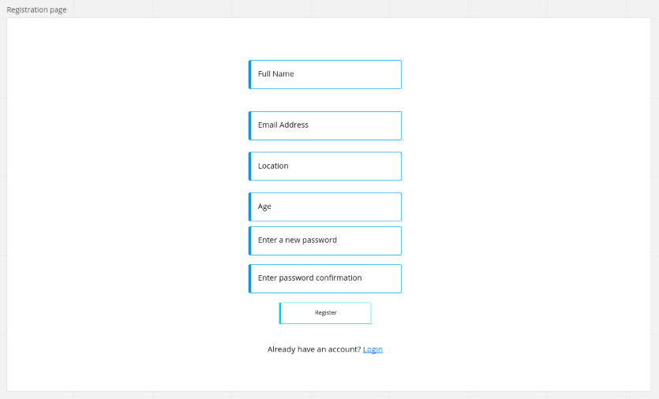
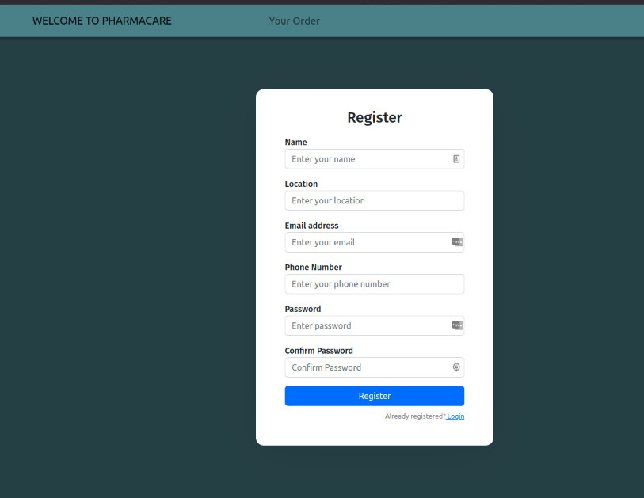

# **PharmaCare**

### By Brayarn Oduor

## **Description**

<p> Sometimes patients cannot reach the pharmacy to purchase medicine due to extreme health complications, or discern the doctor's prescriptions.</p>

<p> <strong>PharmaCare </strong> allows users (patients) to directly order drugs based on their prescription from the website from a list of available pharmacies, and delivered to their doorstep.</p>

### **Link to site**

<a href="https://phase-4-project-pharmacare-frontend.vercel.app/">Pharmacare</a>

<a href="https://github.com/o-brayarn/phase-4-project-pharmacare-backend">Link to the Backend Repo</a>

## **Design**





## **Screenshots**




## **Installation**

### Requirement

- PC
- Access to internet connection

### Installation Process

clone the repo when the link doesn't work properly

```
$ git clone git@github.com:o-brayarn/phase-4-project-pharmacare-frontend.git
```

Install

```
npm install
npm start
```

## **_Tools Used_**

- **main:** _react.js, ruby on rails, postgresql on rails_
- **UI:** _bootstrap, css_
- other libraries: _react-router-dom_

## Known Bugs

- Some functionalities and features break when deployed.

## License

MIT License

Copyright (c) 2022 Brayarn Oduor

Permission is hereby granted, free of charge, to any person obtaining a copy of this software and associated documentation files (the "Software"), to deal in the Software without restriction, including without limitation the rights to use, copy, modify, merge, publish, distribute, sublicense, and/or sell copies of the Software, and to permit persons to whom the Software is furnished to do so, subject to the following conditions:

The above copyright notice and this permission notice shall be included in all copies or substantial portions of the Software.

THE SOFTWARE IS PROVIDED "AS IS", WITHOUT WARRANTY OF ANY KIND, EXPRESS OR IMPLIED, INCLUDING BUT NOT LIMITED TO THE WARRANTIES OF MERCHANTABILITY, FITNESS FOR A PARTICULAR PURPOSE AND NONINFRINGEMENT. IN NO EVENT SHALL THE AUTHORS OR COPYRIGHT HOLDERS BE LIABLE FOR ANY CLAIM, DAMAGES OR OTHER LIABILITY, WHETHER IN AN ACTION OF CONTRACT, TORT OR OTHERWISE, ARISING FROM, OUT OF OR IN CONNECTION WITH THE SOFTWARE OR THE USE OR OTHER DEALINGS IN THE SOFTWARE

## Author details

<a href="brayarn.oduor@student.moringaschool.com">Send me a Mail </a>
